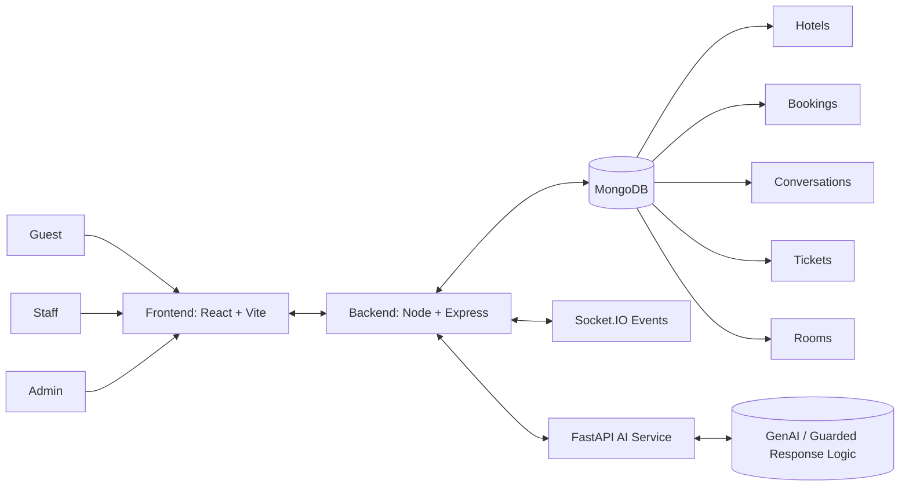
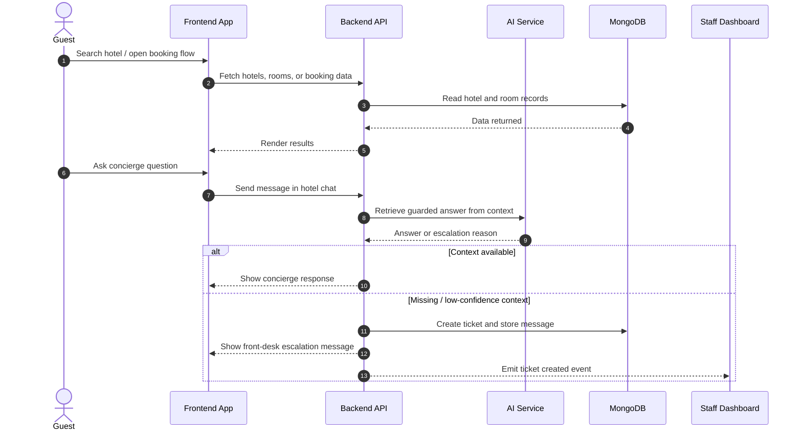

<div align="center">

# AI Hotel Concierge Platform

<p><strong>Unified hotel discovery, booking, concierge, and support experience for guests, staff, and admins.</strong></p>

<p>
	
	
	
	
</p>

<p>
	
	
	
</p>

</div>

> A hotel-locked AI concierge platform that helps guests book stays, ask hotel-specific questions, request services, and escalate unresolved issues to staff in real time.

## Product Highlights

- Guest search, booking, and confirmation flow.
- AI concierge that answers only from hotel context.
- Automatic fallback to front desk when confidence is low.
- Room service, housekeeping, laundry, and support ticket workflows.
- Staff and admin dashboards for operations and hotel management.
- Real-time booking, message, and ticket events with Socket.IO.

## Architecture At A Glance



## User Workflow



## Deep Project Structure

```text
.
├── ai-service/
│   ├── app/
│   │   ├── api/routes.py
│   │   ├── main.py
│   │   ├── models/schemas.py
│   │   └── services/
│   │       ├── analyzer.py
│   │       └── rag.py
│   └── requirements.txt
├── backend/
│   ├── src/
│   │   ├── app.js
│   │   ├── index.js
│   │   ├── config.js
│   │   ├── middleware/
│   │   │   ├── auth.js
│   │   │   ├── errorHandler.js
│   │   │   └── validateObjectId.js
│   │   ├── models/
│   │   │   ├── Booking.js
│   │   │   ├── Conversation.js
│   │   │   ├── Hotel.js
│   │   │   ├── HotelDocument.js
│   │   │   ├── Message.js
│   │   │   ├── Room.js
│   │   │   ├── Ticket.js
│   │   │   └── User.js
│   │   ├── routes/
│   │   │   ├── admin.js
│   │   │   ├── auth.js
│   │   │   ├── bookings.js
│   │   │   ├── concierge.js
│   │   │   ├── dev.js
│   │   │   ├── health.js
│   │   │   ├── hotels.js
│   │   │   └── tickets.js
│   │   ├── socket/
│   │   │   ├── emitter.js
│   │   │   ├── events.js
│   │   │   └── registerSocket.js
│   │   └── utils/
│   │       ├── apiResponse.js
│   │       ├── db.js
│   │       ├── httpClient.js
│   │       └── logger.js
│   └── package.json
├── frontend/
│   ├── src/
│   │   ├── App.jsx
│   │   ├── main.jsx
│   │   ├── api/
│   │   ├── components/
│   │   │   ├── booking/
│   │   │   ├── chat/
│   │   │   ├── common/
│   │   │   ├── layout/
│   │   │   ├── search/
│   │   │   └── staff/
│   │   ├── context/
│   │   ├── hooks/
│   │   ├── pages/
│   │   └── store/
│   └── package.json
├── shared/
│   └── socket-events.json
└── README.md
```

## Team Members And Contributions

| Team Member | Role | Core Contribution |
| --- | --- | --- |
| Yuvaraj C Puggi | Team Lead | Sprint planning, milestone tracking, cross-team alignment, and final reviews |
| Yashwanth G S | Frontend Developer | UI flows for search, booking, concierge, dashboards, and user interaction polish |
| Vishnu H R | Backend Developer | API design, business logic, data handling, and backend validation |
| Vinay C | Technical Documentation Lead | PRS, use cases, acceptance criteria, and weekly documentation |
| Sujal Mehta | Marketing Lead | Problem validation, interview coordination, USP framing, and customer messaging |
| Swamy Kumar | GitHub & Deployment Lead | Repository management, branching strategy, CI/CD coordination, and release tracking |
| Vishesh B V | QA & Testing Lead | Functional testing, regression checks, bug tracking, and sign-off validation |

## Core Capabilities

- Hotel discovery and search filters.
- Booking creation, summary, and confirmation.
- AI concierge with hotel-specific guardrails.
- Ticket escalation for unresolved or service-related requests.
- Staff ticket queue and operational updates.
- Admin hotel and room management.
- Real-time notifications for chat and ticket events.

## Frontend Experience

Primary routes in the app:

- `/` Home
- `/login/user` User login
- `/login/staff` Staff login
- `/login/admin` Admin login
- `/dashboard` User dashboard
- `/results` Search results
- `/hotels/:hotelId` Hotel details
- `/booking/:hotelId` Booking flow
- `/book/:hotelId` Alternate booking flow
- `/confirmation/:bookingId` Booking confirmation
- `/concierge/:bookingId` Concierge chat
- `/staff` Staff dashboard
- `/admin` Admin panel
- `/hotels-dashboard` Hotels dashboard
- `/hotel-management/:hotelId` Hotel management

## Backend API Surface

- `/api/health`
- `/api/auth`
- `/api/hotels`
- `/api/bookings`
- `/api/concierge`
- `/api/tickets`
- `/api/admin`
- `/api/dev`

## AI Service

- `GET /health`
- `POST /chat`

The concierge service is guarded so it answers only from hotel context.

- If context is available, it responds directly.
- If context is missing or confidence is low, it escalates to the front desk.
- Service requests such as towels, housekeeping, laundry, and room service are converted into actionable support flows.

## Real-Time Events

Shared in `shared/socket-events.json`.

- `concierge:typing`
- `message:received`
- `concierge:message`
- `ticket:created`
- `ticket:updated`
- `booking:confirmed`

## Demo Data

The backend seeds sample hotels and rooms automatically when the database is empty.

There is also a development route for demo user/session creation and seed operations in `backend/src/routes/dev.js`.

## Requirements

- Node.js 18 or later
- npm
- Python 3.10 or later
- MongoDB running locally or a MongoDB Atlas connection string

## Environment Variables

Create a `.env` file in the project root using `.env.example` as the base.

```bash
MONGODB_URI=mongodb://localhost:27017
MONGODB_DB_NAME=hotel
JWT_SECRET=change-me
PORT=4000
FRONTEND_ORIGIN=http://localhost:5173
AI_SERVICE_URL=http://localhost:8000
AI_TIMEOUT_MS=10000
ROOM_KEY_SECRET=change-me-room-key
VITE_API_BASE_URL=http://localhost:4000/api
VITE_SOCKET_URL=http://localhost:4000
```

For the AI service:

```bash
GEMINI_API_KEY=your_api_key_here
```

## Setup

### 1. Install Dependencies

```bash
cd backend
npm install

cd ../frontend
npm install

cd ../ai-service
python -m pip install -r requirements.txt
```

### 2. Start the Backend

```bash
cd backend
npm run dev
```

Backend default: `http://localhost:4000`

### 3. Start the Frontend

```bash
cd frontend
npm run dev
```

Frontend default: `http://localhost:5173`

### 4. Start the AI Service

```bash
cd ai-service
uvicorn app.main:app --reload --host 0.0.0.0 --port 8000
```

AI service default: `http://localhost:8000`

## Response Contract

All backend endpoints follow a consistent response pattern.

```json
{
	"success": true,
	"data": {}
}
```

```json
{
	"success": false,
	"error": {
		"code": "ERROR_CODE",
		"message": "Readable error message"
	}
}
```

## Why This Project Feels Modern

- Diagram-driven documentation with Mermaid blocks.
- Clear visual hierarchy and scannable sections.
- Team cards and architecture maps that read like product documentation.
- Real-time workflows and concierge logic that reflect an actual hotel operations product.

## Suggested Next Enhancements

- Payment gateway integration
- Multi-property support with tenant isolation
- Analytics dashboard for guest satisfaction and staff load
- Better guest history and personalization
- Larger hotel document ingestion pipeline for richer AI context

## License

This project is for academic and demonstration purposes unless stated otherwise by the repository owner.
